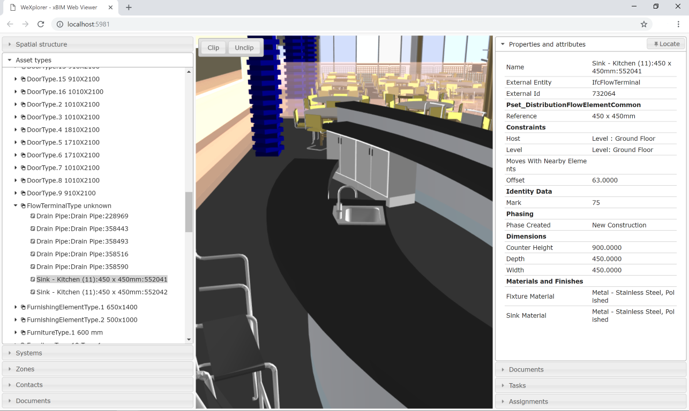

Branch | Build Status  | MyGet | NuGet
------ | ------- | --- | --- |
Master | [](https://dev.azure.com/xBIMTeam/xBIMToolkit/_build/latest?definitionId=1&branchName=master) | [](https://www.myget.org/feed/xbim-master/package/nuget/Xbim.Essentials) | [](https://www.nuget.org/packages/Xbim.Essentials/)
Develop | [](https://dev.azure.com/xBIMTeam/xBIMToolkit/_build/latest?definitionId=1&branchName=develop) |  | -


|Toolkit Component| Latest Myget | Latest Nuget |
| ----| ---- | ----|
|Essentials|  | [](https://www.nuget.org/packages/Xbim.Essentials/)
|Geometry|  | [](https://www.nuget.org/packages/Xbim.Geometry/)
|CobieExpress|  | [](https://www.nuget.org/packages/Xbim.CobieExpress/)
|Windows UI|  | [](https://www.nuget.org/packages/Xbim.WindowsUI/)
|Exchange|  | [](https://www.nuget.org/packages/Xbim.Exchange/)

# XbimEssentials
**XbimEssentials** is the foundational components of [Xbim](https://xbimteam.github.io/), the e**X**tensible 
_[**B**uilding **I**nformation **M**odelling](https://en.wikipedia.org/wiki/Building_information_modeling) toolkit_ for 
the .NET platform. This library enables software developers to easily read, write, validate and interrogate data in 
the buildingSmart [IFC formats](https://en.wikipedia.org/wiki/Industry_Foundation_Classes), using any .NET language. 

As of version 5.0 XbimEssentials includes elementary support for .NET Core 2.0 in addition .NET Framework.

## Updating from prior versions

Please see our [ChangeLog](CHANGELOG.md) for details on what's new and what you need to upgrade. 
In particular, please **note the following section copied here:**

> **BREAKING CHANGE**: Windows forms and Console apps using *IfcStore* must now call `IfcStore.ModelProviderFactory.UseHeuristicModelProvider();` at application startup
>
> [failure to do so] will likely result in use of the very basic `MemoryModel` implementation which does not support *.xbim* files

## Background / Motivation ##

**IFC** is an [ISO Standard](https://www.iso.org/standard/51622.html) and platform-neutral open file format for 
data exchange of building information. 
This library supports *STEP*, *IfcXml* and *IfcZip* formats, and enables you to read and write the full schema of
[IFC2x3](http://www.buildingsmart-tech.org/specifications/ifc-releases/ifc2x3-tc1-release/summary) and 
[IFC4](http://www.buildingsmart-tech.org/specifications/ifc-releases/ifc4-release) (including support for the latest
[Ifc4 Addendum 2](http://www.buildingsmart-tech.org/specifications/ifc-releases/ifc4-add2)).

The wider XBIM toolkit contains additional repositories with libraries to read and write related Open BIM formats including 
[COBie](https://github.com/xBimTeam/XbimExchange) and BIM Collaboration Format ([BCF](https://github.com/xBimTeam/XbimBCF))

In order to visualise 3D Geometries you will need to include the [Xbim.Geometry](https://github.com/xBimTeam/XbimGeometry) 
package which provides full support for geometric, topological operations and visualisation.

The motivation behind XbimEssentials is to take away much of the complexity and 'heavy lifting' required to work 
with Open BIM file formats, so you can focus on creating software solutions without needing deep understanding 
of STEP/Express parsing, 3D graphics, allowing you to work at a higher level than the buildingSmart [data model](http://www.buildingsmart-tech.org/ifc/IFC4/Add2/html/link/introduction.htm). 

## Code Examples

If you want to jump straight in we have some examples [on our docs site](http://docs.xbim.net/examples/examples-list.html).
But here's a 60 second tour of reading and writing:

### 1. Reading data

Given an IFC File [SampleHouse.ifc](Tests/TestFiles/SampleHouse4.ifc) exported from a tool such as Revit, 
this is a simple example showing how you'd read and extract data, using LINQ:

```csharp
const string fileName = "SampleHouse.ifc";
using (var model = IfcStore.Open(fileName))
{
    // get all doors in the model (using IFC4 interface of IfcDoor - this will work both for IFC2x3 and IFC4)
    var allDoors = model.Instances.OfType<IIfcDoor>();

    // get only doors with defined IIfcTypeObject
    var typedDoors = model.Instances.Where<IIfcDoor>(d => d.IsTypedBy.Any());

    // get one single door by its unique identifier / guid
    var id = "2AswZfru1AdAiKfEdrNPnu";
    var theDoor = model.Instances.FirstOrDefault<IIfcDoor>(d => d.GlobalId == id);
    Console.WriteLine($"Door ID: {theDoor.GlobalId}, Name: {theDoor.Name}");

    // get all basic properties of the door
    var properties = theDoor.IsDefinedBy
        .Where(r => r.RelatingPropertyDefinition is IIfcPropertySet)
        .SelectMany(r => ((IIfcPropertySet)r.RelatingPropertyDefinition).HasProperties)
        .OfType<IIfcPropertySingleValue>();
    foreach (var property in properties)
        Console.WriteLine($"Property: {property.Name}, Value: {property.NominalValue}");
}
```

... resulting in output like:

```
Door ID: 3cUkl32yn9qRSPvBJVyWYp, Name: Doors_ExtDbl_Flush:1810x2110mm:285860
Property: IsExternal, Value: true
Property: Reference, Value: 1810x2110mm
Property: Level, Value: Level: Ground Floor
Property: Sill Height, Value: 0
Property: Area, Value: 4.9462127188431
Property: Volume, Value: 0.193819981582386
Property: Mark, Value: 1
Property: Category, Value: Doors
Property: Family, Value: Doors_ExtDbl_Flush: 1810x2110mm
Property: Family and Type, Value: Doors_ExtDbl_Flush: 1810x2110mm
Property: Head Height, Value: 2110
Property: Host Id, Value: Basic Wall: Wall-Ext_102Bwk-75Ins-100LBlk-12P
Property: Type, Value: Doors_ExtDbl_Flush: 1810x2110mm
Property: Type Id, Value: Doors_ExtDbl_Flush: 1810x2110mm
Property: Phase Created, Value: New Construction
```

### 2. Amending data

In this simple example we're going to add a 'purchase cost' property to a single Door. 
We could have applied the cost against the Door Type if all instances of it shared the property.

```csharp
const string fileName = "SampleHouse.ifc";
var editor = new XbimEditorCredentials
{
    ApplicationDevelopersName = "EZ Bim Apps Inc",
    ApplicationFullName = "My BIM App",
    ApplicationIdentifier = "my-bim-app",
    ApplicationVersion = "1.0",
    EditorsFamilyName = "John",
    EditorsGivenName = "Doe",
    EditorsOrganisationName = "Acme Consultants Inc"
};

using (var model = IfcStore.Open(fileName, editor, true))
{
    // get an existing door from the model
    var id = "3cUkl32yn9qRSPvBJVyWYp";
    var theDoor = model.Instances.FirstOrDefault<IfcDoor>(d => d.GlobalId == id);

    // open transaction for changes
    using (var txn = model.BeginTransaction("Doors modification"))
    {
        // create new property set to host properties
        var pSetRel = model.Instances.New<IfcRelDefinesByProperties>(r =>
        {
            r.GlobalId = Guid.NewGuid();
            r.RelatingPropertyDefinition = model.Instances.New<IfcPropertySet>(pSet =>
            {
                pSet.Name = "Commercial";
                pSet.HasProperties.Add(model.Instances.New<IfcPropertySingleValue>(p =>
                {
                    p.Name = "PurchaseCost";
                    p.NominalValue = new IfcMonetaryMeasure(200.00); // Default Currency set on IfcProject
                }));
            });
        });

        // change the name of the door
        theDoor.Name += "_costed";
        // add properties to the door
        pSetRel.RelatedObjects.Add(theDoor);

        // commit changes
        txn.Commit();
    }
}
```

### 3. Generating Geometry

We need to generate geometry from the IFC primitives before you can visualise the 3D model. This essentially
produces a tesselation/mesh that can be fed into a 3D graphics card, typically via some Graphics Library 
(OpenGL, DirectX, WebGL etc)

> **Note:** Generating the 3D Geometry requires the [Xbim.Geometry](https://github.com/xBimTeam/XbimGeometry) package
which is currently only supported on a Windows platform. This utililises a native geometry engine to handle 
boolean operations / [CSG](https://en.wikipedia.org/wiki/Constructive_solid_geometry)

Since this process can take some seconds / minutes for larger models, and can consume significant computation resource, 
it's common to do the geometry generation once and store in the _xbim_ database format for future use. 

For web-based visualisation an alternative is to output geometry to the _wexbim_ format, which is optimised for web delivery in a browser
using [Xbim.WebUI](http://docs.xbim.net/XbimWebUI/)

```csharp
const string fileName = @"SampleHouse4.ifc";
var wexBimFilename = Path.ChangeExtension(fileName, "wexBIM");
var xbimDbFilename = Path.ChangeExtension(fileName, "xBIM");

// Make sure we are using an IModel implementation that supports saving of '.xbim' files
IfcStore.ModelProviderFactory.UseHeuristicModelProvider();
	
using (var model = IfcStore.Open(fileName))
{
	// IFC file is already parsed and open. Now build the 3D
	var context = new Xbim3DModelContext(model);
	context.CreateContext();	// Creates the Geometry using native GeometryEngine

	// Optional: Export to 'wexbim' format for use in WebUI's xViewer - geometry only
	using (var wexBimFile = File.Create(wexBimFilename))
	{
		using (var wexBimBinaryWriter = new BinaryWriter(wexBimFile))
		{
			model.SaveAsWexBim(wexBimBinaryWriter);
			wexBimBinaryWriter.Close();
		}
		wexBimFile.Close();
	}
		
	// Save IFC to the internal XBIM format, which includes geometry
	model.SaveAs(xbimDbFilename, StorageType.Xbim);
}
```

## Screenshots

The XBIM Team have developed a couple of demonstrator apps to show how the toolkit can be used to develop your
own applications. Both are open source under our team space on GitHub.


The Windows [Xbim Xplorer](http://docs.xbim.net/downloads/xbimxplorer.html) application is functional demonstrator 
application that shows off most of the functionality in the XBIM toolkit. The app supports visualising and inspecting multiple 
model files, as well as supporting plugins to export COBie, import/export BCF and more.


The browser-based [Xbim WeXplorer](http://docs.xbim.net/XbimWebUI/) is a simple demonstrator of visualising models in a browser
and an ability open sementic model data from a JSON structure.

## Getting Started

You will need Visual Studio 2015 or newer to compile the Solution. Visual Studio 2017 is recommended. 
Prior versions of Visual Studio should work, but we'd recomments 2017 where possible
The [free VS 2017 Community Edition](https://visualstudio.microsoft.com/downloads/) should work fine. 
All projects target .NET Framework 4.7, with some projects also targeting .netstandard2.0, which should 
permit limited trials of XBIM with .NET Core / Mono etc.

### Using the library

To get started, the simplest approach is to add the `Xbim.Essentials` nuget package to your Visual Studio Project 
from [Nuget](https://www.nuget.org/packages/Xbim.Essentials/). 

Alternatively you can add the package using Nuget's Package Manager Console and issuing the following command:

```
PM> Install-Package Xbim.Essentials
```

Note that `Xbim.Essentials` is now a meta package. For more control it will be possible to add the 
dependent packages directly. (Which is necessary for .NET Core currently, as Essentials only targets net47)

## Toolkit Overview


### How to use it?

XbimEssentials is a software library to be used for the creation of complex applications, other repositories under the
[XbimTeam](https://github.com/xBimTeam) page include a number of example applications to demonstrate its capabilities.

If you wish to move your first steps these are the first resources to lookup:

* [The example list page](http://docs.xbim.net/examples/examples-list.html) can act as a short tutorial 
to familiarise with the library.

* [Small examples](https://github.com/xBimTeam/XbimSamples) - a list of small console application demonstrating 
how to undertake simple IFC activities with Xbim that compiles and runs in visual studio.

* [XbimXplorer](http://docs.xbim.net/downloads/xbimxplorer.html) - is a fairly complex WPF sample application 
that can open and render 3D IFC models as well as displaying semantic data, 
its source code is available in the [Xbim.WindowsUI repo](https://github.com/xBimTeam/XbimWindowsUI).

## Licence

The XBIM library is made available under [the CDDL Open Source licence](LICENCE.md).

All licences should support the commercial usage of the XBIM system within a 'Larger Work', as long as you honour
the licence agreements.

## Third Party Licences

The core XBIM library makes use of the following 3rd party software packages, under their associated licences:

* 'OpenCASCADE' Geometry Engine : http://www.opencascade.org/ - OPEN CASCADE Public License
* 'Gardens Point Parser Generator' http://gppg.codeplex.com/ - New BSD Licence
* Elements of '3D Tools' WPF library http://3dtools.codeplex.com/ - MS Permissive Licence
* Log4net : http://logging.apache.org/log4net/ - Apache 2.0 Licence
* NPOI : http://npoi.codeplex.com - Apache 2.0 Licence
* NewtonSoft JSON : http://json.codeplex.com/ - MIT Licence

All 3rd party licences are permissive-style licences. We actively avoid Copyleft/GPL style licences to retain
compatibility with our CDDL licence - meaning you can use the XBIM Toolkit in a closed-source commercial software package.

## Support & Help

We have some guidance, examples and a FAQ on our [docs site](http://docs.xbim.net/). We're always looking
for help with areas like documentation - please see our [Docs Repo](https://github.com/xBimTeam/XbimDocs) if you 
think you can help with a PR.

For bugs, and improvements, please use the GitHub Issues of the relevant repository. 

If you have a question, or need some help, you may find the
[Stackoverflow xbim](https://stackoverflow.com/questions/tagged/xbim) tag a good place to start.

## Acknowledgements
While we do not qualify anymore for open source licenses of JetBrains, we would like to acknowledge the 
good work and thank [JetBrains](https://www.jetbrains.com/) for supporting the XbimToolkit project with 
free open source [Resharper](https://www.jetbrains.com/resharper/) licenses in the past.

[](https://www.jetbrains.com/resharper/)

Thanks also to Microsoft Azure DevOps for the use of [Azure Pipelines](https://azure.microsoft.com/en-us/services/devops/pipelines/) 
to automate our builds.

## Getting Involved

If you'd like to get involved and contribute to this project, please read the [CONTRIBUTING ](https://github.com/xBimTeam/XbimEssentials/blob/master/CONTRIBUTING.md) page or contact the Project Coordinators @CBenghi and @martin1cerny.
