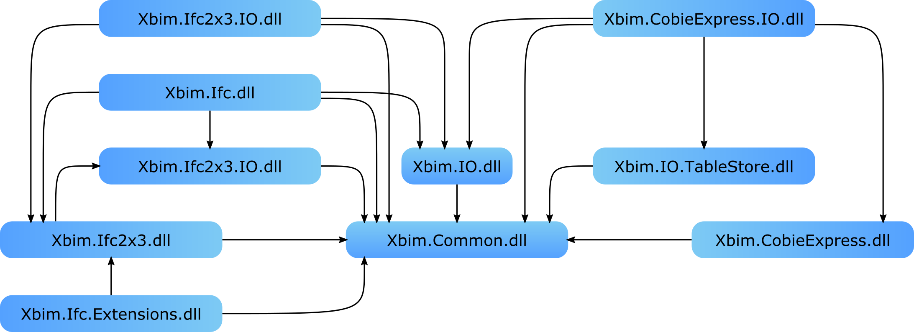

---
title: 'Xbim.Essentials: a library for interoperable building information applications'
tags:
  - BIM
  - BuildingSmart
  - IFC
  - COBie
authors:
 - name: Steve Lockley
   affiliation: 1
 - name: Claudio Benghi
   orcid: 0000-0003-3252-5461
   affiliation: 1
 - name: Martin Černý
   orcid: 0000-0003-2248-0781
   affiliation: 1
affiliations:
 - name: Northumbria University
   index: 1
date: 4^th^ September 2017
bibliography: paper.bib
...

# Summary

The Xbim.Essentials library offers data extraction, data transformation and data validation functions for Building Information Models (BIM); its robust and optimised implementation allows efficient operations on gigabyte-range files for researchers and practitioners interested in the built environment.

The library implements the complete object model of BuildingSMART's IFC schemas [-@buildingSMARTSummaryIFCReleases2017] along with APIs for their management under the terms of the CDDL [@SunMicrosystemsCommonDevelopmentDistribution2005], which makes it also suitable for commercial research and development projects.

Relevant fields of research span from social sciences to construction engineering and applied mathematics on account of the breadth of domains covered in the over 800 classes of the schema across building lifecycles.

The project implements public APIs for:

- Federating, merging and splitting models and entities within models  (non-trivial because of cyclic and bi-directional relationships defined in the schemas).
- Verification of data quality through EXPRESS WHERE clauses and metadata constraints.
- programmatic management of IFC properties and relations through Schema Metadata.
- Single point management of any IFC file, including XML, STEP21 and IFCZIP formats.

Architectural features of the solution include:

- Full access to the models through C# interfaces, allowing schema-agnostic data logic on any supported version.
- Disk-based and in-memory options to suit diverse workflow infrastructures.
- Log management for notification events where exceptions are not appropriate.

Additionally, the Xbim.IO.TableStore namespace supports similar APIs, when conceptually suitable, on BuildingSMART's COBie object model [@buildingSMARTCOBieModelview2013], extending the domain of relevance to construction operations and facility management.

Where appropriate, classes in the codebase are generated programmatically from the formal EXPRESS specification files [@ISOISO10303112004Industrial2013] ensuring full compliance with the standards.

Schemas currently implemented are: 'IFC2x3 Technical Corrigendum 1' [@ModelSupportGroupIFC2x3TechnicalCorrigendum2007], 'IFC4 Addendum 1' [@ModelSupportGroupIFC4AddendumFinal2015] and 'COBie MVD' [@buildingSMARTCOBieModelview2013].

The library has been developed over many years and has supported several research projects such as iCAT [-@InnovateUKinteroperableCarbonAssessment2010], 4BIM [-@InnovateUK4BIM2012], Digital tool for Bim [-@InnovateUKdigitaltoolbuilding2014], Decc-MR [-@InnovateUKDECCMRDigitalEngineering2015] and Tier2Tier [-@InnovateUKTier2Tiercollaborationinterface2015].

Xbim.Essentials also enabled the work of several scholars who, in absence of clear guidelines, have informally referenced its usage, such as Thomson and Boehm [-@ThomsonAutomaticgeometrygeneration2015], Porter [-@PorterBreakingBIMphysical2014], Braun et al. [-@BraunClassificationdetectionstates2017], Černỳ [-@CernyGISanalyzyprostredi2014],
Weise et al. [-@WeiseIFCmodelchecking2017] and Roupé et al. [-@RoupeVirtuellproduktionsplaneringmed2014].

The source code is written in C# and its repository is hosted on Github [@xBimTeamXbimEssentialssourcecode2017], online documentation is available [@xBimTeamxBIMToolkitDocumentation2017] and compiled binaries can be installed via Nuget.org searching for "Xbim.Essentials".

# References
