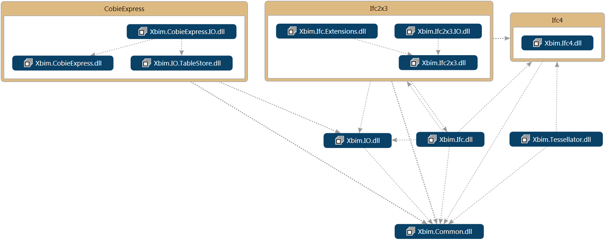

---
title: 'Xbim.Essentials: a library for interoperable building information applications'
tags:
  - BIM
  - BuildingSmart
  - IFC
  - COBie
authors:
 - name: Steve Lockley
   affiliation: 1
 - name: Claudio Benghi
   orcid: 0000-0003-3252-5461
   affiliation: 1
 - name: Martin Černý
   affiliation: 1
affiliations:
 - name: Northumbria University
   index: 1
date: 04 September 2017
bibliography: paper.bib
...

# Summary

The Xbim.Essentials library offers the open-source infrastructure to develop Building Information Modelling (BIM) solutions for commercial, research and open-source environments under the terms of the CDDL [@sun_microsystems_common_2005].

The library implements the complete object model of BuildingSMART's IFC schemas [@buildingsmart_international_summary_2017] along with APIs for their management in a production environment under the Microsoft .Net framework.

APIs are available for:

- Single point management of any IFC file, including XML, STEP21 and IFCZIP formats
- Disk-cached and in-memory options to suit a range of deployment infrastructures
- Federation, merging and deleting entities and sub-sets of models (a non-trivial function because of potential cyclic and bi-directional relationships)
- Embedded Schema Metadata information for programmatic data extraction and presentation of IFC properties
- Verification of model consistency through EXPRESS WHERE clauses and metadata constraints
- Read and write c# interfaces across schema versions, allowing to develop one code base for multiple formats
- log management for notification events where exceptions are not appropriate

Additionally, the Xbim.IO.TableStore namespace supports similar APIs, where appropriate, on BuildingSMART's COBie object model [@buildingsmart_cobie_2013].

Where possible, classes in the codebase are generated programmatically from the EXPRESS specification files [@iso_iso-10303-11:2004_2013] ensuring full compliance with the standards. Schemas currently implemented are:

- IFC2x3 Technical Corrigendum 1 [@model_support_group_ifc2x3_2007]
- IFC4 Addendum 1 [@model_support_group_ifc4_2015]
- COBie MVD [@buildingsmart_cobie_2013]

The library has developed over many years supporting both research and development projects such as iCAT [-@innovateuk_interoperable_2010], 4BIM [-@innovateuk_4bim_2012], Digital tool for Bim [-@innovateuk_digital_2014], Decc-MR [-@innovateuk_decc-mr_2015] and Tier2Tier [-@innovateuk_tier2tier_2015].

Xbim.Essentials also enabled the work of several scholars who, in absence of clear guidelines, have informally referenced its usage, such as Thomson and Boehm [-@thomson_automatic_2015], Porter [-@porter_breaking_2014], Braun et al. [-@braun_classification_2017], Černỳ [-@cerny_gis_2014],
Weise et al. [-@weise_ifc_2017] and Roupé et al. [-@roupe_virtuell_2014].

The source code repository is hosted on github [@xbimteam_xbimessentials_2017], online documentation is available [@xbimteam_xbim_2017] and compiled binaries are available on nuget.org searching for `Xbim.Essentials`.

# References
